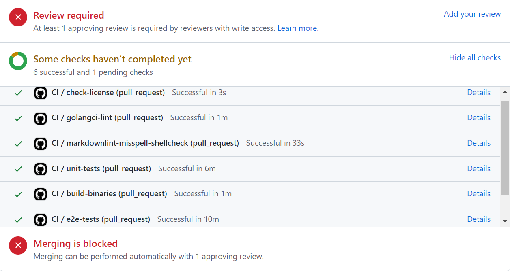

This article will introduce the CI Workflow which all pull requests should pass before being merged. The CI Workflow of OpenYurt is built based on Github Actions. Details of Github Actions can be found at its [official documentation](https://docs.github.com/cn/actionsh). The config of the CI Workflow is located at [ci.yaml](https://github.com/openyurtio/openyurt/blob/master/.github/workflows/ci.yam).

The current CI Worflow of OpenYurt contains the following checks:

1. check-license
2. golangci-lint
3. markdownlint-misspell-shellcheck
4. unit-tests
5. build-binaries
6. e2e-tests

At the moment you submit a pull request to OpenYurt, Github Actions will be triggered to check your PR. A pull request can not be merged until it passed all the checks in Github Actions as the following picture shows:



You can click `Details` to check logs to solve the problem if you find some checks failed. The article will then give the discription of all six checks to help you understand why some of these checks fail. By the way, all of these checks can run at your local host.

## check-license

`check-license` will check all the `.go` and `.sh` files to ensure all of them have a license. It will use the bash shell [check_license.sh](https://github.com/openyurtio/openyurt/blob/master/hack/make-rules/check_license.sh). If it finds some files don't contain license, it will output their paths.

license is a statement in the comments at the beginning of the file. The following license is what OpenYurt uses:

```text
Copyright 2021 The OpenYurt Authors.

Licensed under the Apache License, Version 2.0 (the "License");
you may not use this file except in compliance with the License.
You may obtain a copy of the License at

    http://www.apache.org/licenses/LICENSE-2.0

Unless required by applicable law or agreed to in writing, software
distributed under the License is distributed on an "AS IS" BASIS,
WITHOUT WARRANTIES OR CONDITIONS OF ANY KIND, either express or implied.
See the License for the specific language governing permissions and
limitations under the License.
```

## golangci-lint

`golangci-lint` will check the format of all go source code files. It uses the tool `golangci-lint` with serval linters to do the check. More details of `golangci-lint` can be found at the [doc](https://golangci-lint.run/). This sections will give the brief introduction of linters used by OpenYurt.

The config file of `golangci-lint` is at [.golangci.yaml](https://github.com/openyurtio/openyurt/blob/master/.golangci.yaml). The enabled linters and their descriptions are as follows:

| linter                                                                            | description                                                                                                                             |
| --------------------------------------------------------------------------------- | --------------------------------------------------------------------------------------------------------------------------------------- |
| [deadcode](https://github.com/remyoudompheng/go-misc/tree/master/deadcode)        | Finds unused code                                                                                                                       |
| [gofmt](https://pkg.go.dev/cmd/gofmt)                                             | checks whether code was gofmt-ed. By default this tool runs with -s option to check for code simplification                             |
| [goimports](https://pkg.go.dev/golang.org/x/tools/cmd/goimports?utm_source=godoc) | In addition to fixing imports, goimports also formats your code in the same style as gofmt.                                             |
| [gci](https://github.com/daixiang0/gci)                                           | Gci control golang package import order and make it always deterministic                                                                |
| [ineffassign](https://github.com/gordonklaus/ineffassign)                         | Detects when assignments to existing variables are not used                                                                             |
| [misspell](https://github.com/client9/misspell)                                   | Finds commonly misspelled English words in comments                                                                                     |
| [vet](https://pkg.go.dev/cmd/vet)                                                 | Vet examines Go source code and reports suspicious constructs, such as Printf calls whose arguments do not align with the format string |

You can use `make lint` at your local host to run these checks. This command will automatically install the `golangci-lint` tool if not found. Running this command at local host will show more details than what Github Actions will output, such as the error lines. We always recommend running `make lint` at your local host before submitting a pull reuqest.

## markdownlint-misspell-shellcheck

OpenYurt uses the [pouchlinter](https://github.com/pouchcontainer/pouchlinter) to do this check, which contains some installed lint tools we need: [misspell](https://github.com/client9/misspell) and [markdownlint](https://github.com/markdownlint/markdownlint). misspell will check if there're some misspelled English words. It will output the file path and line number, if any. markdownlint will check if markdown files repect specified rules. The descriptions of all rules can be found at the [doc](https://github.com/markdownlint/markdownlint/blob/master/docs/RULES.md). In this check, `MD010`, `MD013`, `MD022`, `MD024`, `MD029`, `MD031`, `MD032`, `MD033`, `MD034`, `MD036` will not be respected.

## unit-tests

In this check, all go files with suffix `_test.go` will be executed. These files usually contain test cases of some functions and modules. The following command will be used to run these tests:

```bash
make test
```

## build-binaries

This check will try to build binaries of all OpenYurt components on the `linux/amd64` platform, including `yurtctl`, `yurt-node-servant`, `yurt-hub`, `yurt-controller-manager`, `yurt-tunnel-server` and `yurt-tunnel-agent`. It will use the following command to build these binaries:

```bash
make build
```

## e2e-tests

In this check, a OpenYurt cluster with two nodes will be set up to run e2e test cases under `test` folder. OpenYurt also provide a way to run this test at your local host which you can find at [Local Up OpenYurt](./local-up-openyurt.md). Currently, the following e2e test cases will run during this check:

| Case                     | Description                                                                          |
| ------------------------ | ------------------------------------------------------------------------------------ |
| cluster_info             | Fetch cluster info from the cluster, including the number of pods and all namespaces |
| pod_operate_test         | Create/Delete pod on the edge node                                                   |
| pod_operate_test_on_edge | Execute command in the pod on the edge node                                          |
