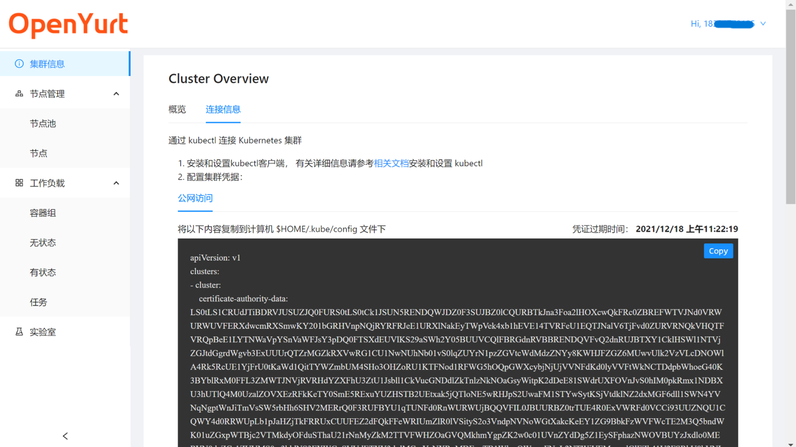

## Overview

As an edge cloud native project, OpenYurt crosses edge computing and cloud native two fields. Many developers from edge computing background are not familiar with cloud native related technologies. In order to lower the threshold of using OpenYurt and help developers get started with OpenYurt quickly, our community has launched a platform called [OpenYurt Experience Center](http://47.242.50.237/). Instead of building an OpenYurt cluster from scratch, new users who want to try out OpenYurt's features can simply apply for a test account on the platform and then they will have an available OpenYurt cluster right away.

## Features

Platform will assign an OpenYurt cluster to each [registered user](./user.md). (Note that this cluster is not a full-featured K8s cluster and this means users can only operate under their own namespaces; refer to the Architecture section for details)

OpenYurt Experience Center has provided two ways to use OpenYurt cluster:

1. Users can use the [Web Console](./web_console.md) provided by platform to manage the cluster. The console displays the status of the cluster and provides some simple operations, such as: user management, node access, node autonomy settings, several OpenYurt applications, and so on.

2. The Experience Center also provides another way via [`kubeconfig`](./kubeconfig.md), where users can configure `kubeconfig` locally and operate the cluster via the `kubectl` command.

## Architecture

> [Yurt-dashboard](https://github.com/openyurtio/yurt-dashboard) is an open source project, and any suggestions and feedback are welcome.
> Besides, if you are interested in the implementation of the experience center, you can refer to the [video record](https://www.bilibili.com/video/BV1pf4y1K7M4) of biweekly meetings.

The experience center consists of three main parts:

1. Yurt Dashboard: yurt-dashboard is a web console similar to the kubernetes dashboard that contains front-end and back-end web applications. The front-end provides a graphical interface, while the back-end is responsible for communicating with the cluster's API Server.
2. Account Controller: user information of the platform is stored in the cluster through CRD. Account Controller is responsible for managing the creation and deletion of user accounts and related resources (e.g. namespace, certificates, etc).
3. Autonomy Sidecar: all users in experience center share the same OpenYurt cluster. The Autonomy component implements multi-tenant isolation of the cluster, so that each user can share the same Master, and also has exclusive access to their own edge resources.
