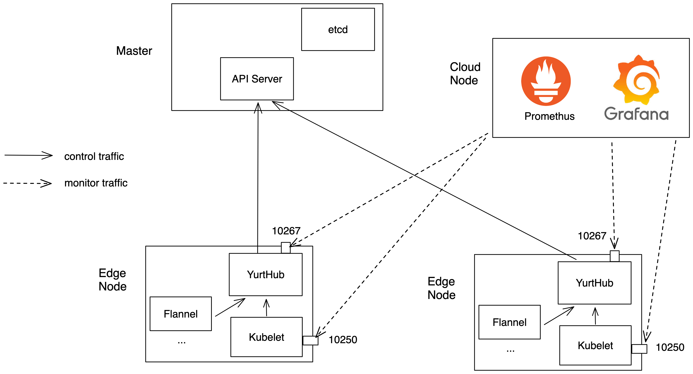
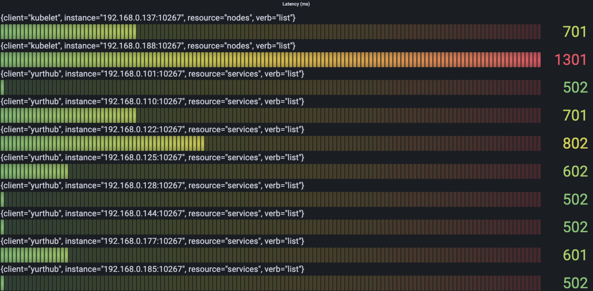
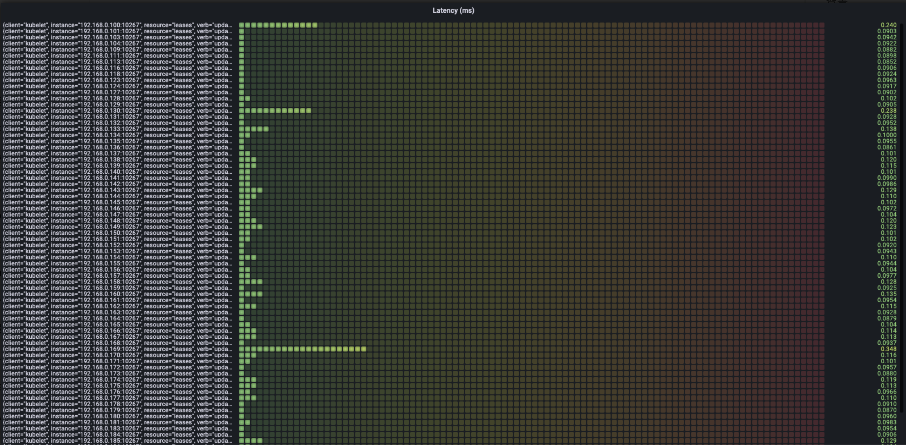
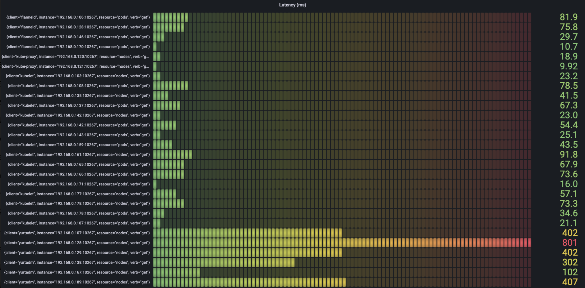
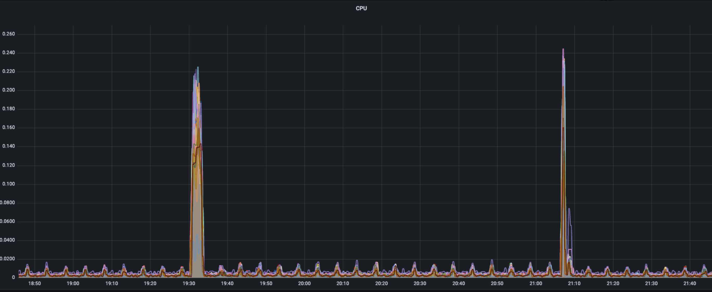

## Background
On the one hand, YurtHub is an important component of OpenYurt，providing the additional abstraction, taking over the traffic from edge to cloud, and supporting the key abilities of Node Autonomy, Flow Closed Loop, and so on. On the other hand, lots of the cloud native scenarios are troubled by the resource limitation of the edge node, as the important component of OpenYurt, the performance of YurtHub in different situation play an influential role in the cluster of OpenYurt. Therefore, we need to obtain deeper understanding on the performance of YurtHub.
## Test Environment
### Kubernetes Version
`Major:"1", Minor:"22", GitVersion:"v1.22.12", GitCommit:"b058e1760c79f46a834ba59bd7a3486ecf28237d", GitTreeState:"clean", BuildDate:"2022-07-13T14:53:39Z", GoVersion:"go1.16.15", Compiler:"gc", Platform:"linux/amd64"`
### OpenYurt Version
`GitVersion:"v0.7.0", GitCommit:"d331a42", BuildDate:"2022-08-29T13:33:43Z", GoVersion:"go1.17.12", Compiler:"gc", Platform:"linux/amd64"`
### Node Configuration
Master and WorkNode use the ECSs with different configurations, and the used cluster contains one master and other one hundred worknodes. All worknodes join the cluster by using the command `yurtadm` on edge mode.
#### Operating System
|  | Master  | Node  |
| --- | --- | --- |
| LSB Version  | :core-4.1-amd64:core-4.1-noarch | :core-4.1-amd64:core-4.1-noarch |
| Distributor ID  | CentOS | CentOS |
| Description | CentOS Linux release 7.9.2009 (Core) | CentOS Linux release 7.9.2009 (Core) |
| Release  | 7.9.2009 | 7.9.2009 |
| Codename | Core | Core |

#### CPU
|  | Master  | Node  |
| --- | --- | --- |
| Architecture  | x86_64 | x86_64 |
| CPU op-mode (s) | 32-bit, 64-bit | 32-bit, 64-bit |
| Byte Order  | Little Endian  | Little Endian  |
| CPU (s) | 8 | 2 |
| On-line CPU(s) list | 0-7 | 0,1 |
| Thread(s) per core | 2 | 2 |
| Core(s) per socket | 4 | 4 |
| Socket(s)  | 1 | 1 |
| NUMA node(s) | 1 | 1 |
| Vendor ID  | GenuineIntel | GenuineIntel |
| CPU family  | 6 | 6 |
| Model  | 106 | 106 |
| Model name  | Intel(R) Xeon(R) Platinum 8369B CPU @ 2.70GHz | Intel(R) Xeon(R) Platinum 8369B CPU @ 2.70GHz |
| Stepping  | 6 | 6 |
| CPU MHz | 2699.998 | 2699.998 |

#### Memory 
|  | Master  | Node  |
| --- | --- | --- |
| Total memory  | 32245896 K | 7862304 K |

#### Disk
|  | Master                     | Node                 |
| --- |-----------------------|----------------------|
| Total Size   | 40GiB (3800 IOPS)          | 40GiB (3800 IOPS)    |
| Type  | ESSD Cloud Disk PL0        | ESSD Cloud Disk PL1  |

## Test Method
Through Promethus collecting three types of indicators from the edge side in the OpenYurt cluster.

- Resource Occupation：YurtHub container CPU/Mem usage
- Data Traffic：YurtHub forward the traffic of request
- Request Delay：the delay of YurtHub forwarding request

The overall test architecture is shown in the following figure

## Test Result
> 15:00-19:00 worknodes join successively
> 19:30 creating 2000 Pod， 1000 Service (deploying by Daemonset format, per node deploys 20 Pods, per Service contains 50 Endpoints)
> 19:35 all resources creating complete
> 21:06 delete all resources

### Traffic 

The above picture is the whole performance of request traffic of YurtHub in the scenario of 100 edge nodes, and the following features can be observed:

- In normal situation, traffic data have a wave of 5min period, and peak ranges 15-20 KB/s
- In the process of workload deploying, traffic booms one time, and peak is 350 KB/s
- In the process of workload downloading, traffic alse booms one time, having shorter duration time and higher peak about 780 KB/s

For further exploration of the source of traffic, we select one machine to analyze the traffic usage

The above figure shows the usage of traffic as workload deploying, we can get the rank of usage orderly when traffic mutating:

- endpointslices, watch, 240 KB/s
- endpoints, watch, 50 KB/s 
- services, watch, 25 KB/s
- nodes, watch, 24 KB/s
- pod, watch, 3 KB/s

The peak of traffic of machine is approximately 320 KB/s, and those traffic contain mostly watch requests about service. The count of endpoint in service(per service 50 endpoints) may cause such situation. In normal case, the watch request about nodes also causes the variety of traffic of 5min period.

The above figure show the performance of traffic of machine in the process of uninstalling, total peak of traffic reach about 780k. Sorting by resource and action, the usage of traffic as the following data show:

- endpointslices, watch, 540 KB/s
- service, watch, 140 KB/s
- endpoints, watch, 100 KB/s
### Latency
When collecting latency, we conclude two types latency:

- Full_latency：record the total time from request reaching YurtHub to request leaving YurtHub
- Apiserver_latency：record the time from request forwarded by YurtHub to apiserver
> In the procedure of actual testing, two types latency have no difference, so we have full_latency as standard

The following figure show the situation of time spending mostly in the request per type as we see from verb:

- Delete

- Create

- List

- Update

- Patch

- Get

We can see the most time-spending requests mainly are the request of create/get/list about node and the request of list about service.
### Memory

In the initial state, before workload deploying, the memory occupation of YurtHub mostly ranges 35-40MB. Two machines use memory mostly, because the monitor suite of Prometheus deploy on those. The bottom line show the variety of YurtHub which is deployed on master by cloud mode. At 19:30 per node deployed 20 Pods, the memory of node improve about 2-5MB, and sustain such level. After workload is deleted, the memory reduce 10MB obviously, and recover to the previous level.
### CPU

The occupation of single core CPU is similar to the usage of traffic, normally periodic wave sustains a low level(approximately 0.02%), two peaks of wave show at times of workload deploying（22%）and workload deleting（25%）.

## Conclusion and Analysis

- Without the pressure of workload, YurtHub occupys memory of approximately 30-40MB and rare CPU（< 0.02）.
   - CPU mainly apply to handle the request received by YurtHub, and the peak of single core occupation could reach about 25% when resource creating.
   - The level of memory is related to the distribution of workload, and varies about 5MB when resource is created and deleted. After all workloads are deleted, memory occupation of YurtHub reduces largely then back to previous level, and specific causes waits to be analysed.
- The usage of YurtHub traffic shows, in the procedure of resource creating and destroying, lots of requests spring(respectively 350 KB/s and 780 KB/s) in short time, among most traffic come from watch requests related to service(endpointslice, endpoint, service).
- The delay in the procedure of YurtHub forwarding request can be ignored comparing to request itself, and the delay of request mainly is related to the size of request resource.
