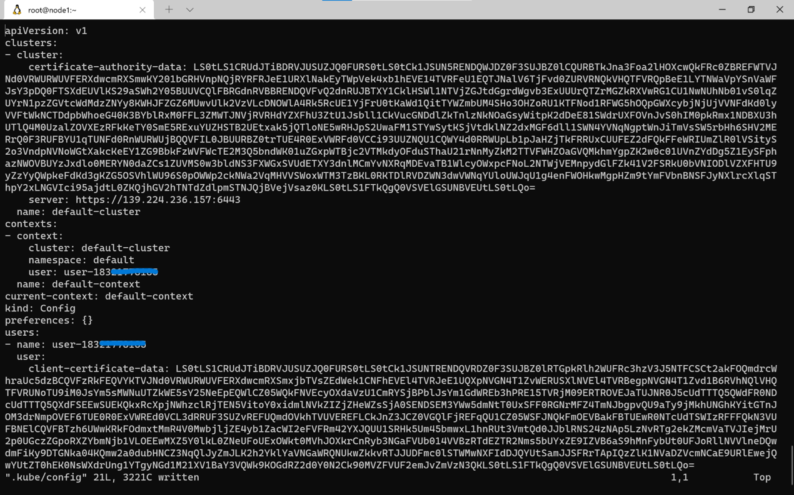
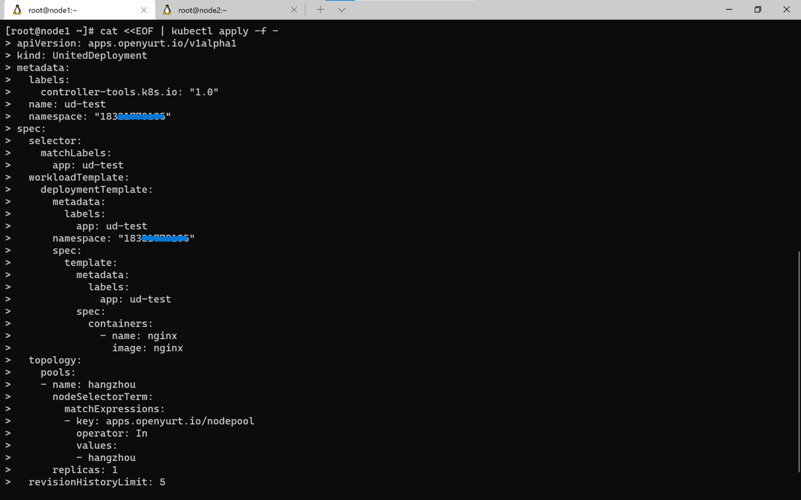

> 这份文档将介绍如何使用体验中心中提供的 kubeconfig 体验 OpenYurt 的单元化部署能力。

## 本地配置 `kubeconfig`

用户需要在本地配置 `kubeconfig` 后，才能通过`kubectl`管理集群。

1. 在“集群信息”页面下“连接信息”tab 里复制`kubeconfig`信息


2. 将复制的`kubeconfig`信息保存到本地`~/.kube/config`文件下



3. 如果配置无误，就可以使用`kubectl`来管理集群了


## 体验 OpenYurt 的单元化部署功能

OpenYurt 针对边缘计算场景，允许用户将工作负载分组到分布在不同地理位置的不同单元中。下面通过一个简单的场景来体验 OpenYurt 的单元化部署能力。

现在有两个边缘端的节点 node1 与 node2 分布在不同的位置（比如 node1 在杭州，node2 在上海），我们希望部署应用到杭州的节点，而不要部署到上海的节点。OpenYurt 通过[NodePool](https://github.com/openyurtio/openyurt/blob/master/docs/enhancements/20201211-nodepool_uniteddeployment.md) 与 [YurtAppSet](https://github.com/openyurtio/openyurt/blob/master/docs/enhancements/20201211-nodepool_uniteddeployment.md) (previous UnitedDeployment)两种资源来实现这个能力。

1. 假设我们已经在 OpenYurt 集群中接入了两个节点 node1 与 node2。（不知道如何接入节点？请参照[文档：如何使用 web_console](./web_console.md)）


2. 在配置好`kubeconfig`的本地通过命令行工具`kubectl`中创建 NodePool 资源，并将 node1 加入其中该 NodePool。

```bash
# 创建nodepool hangzhou
cat <<EOF | kubectl apply -f -
apiVersion: apps.openyurt.io/v1alpha1
kind: NodePool
metadata:
  name: hangzhou
spec:
  type: Edge
EOF


# 将node1节点加入nodepool
kubectl label node node1 apps.openyurt.io/desired-nodepool=hangzhou

# 获取nodepool
kubectl get nodepool
```


此时在控制台界面中也可以看到对应的节点池 NodePool 信息。


3. 通过`kubectl`创建 Workload 资源，通过 YurtAppSet 只把应用部署到 hangzhou 的节点池中。

```bash
# 单元化部署pod
cat <<EOF | kubectl apply -f -
apiVersion: apps.openyurt.io/v1alpha1
kind: UnitedDeployment
metadata:
  labels:
    controller-tools.k8s.io: "1.0"
  name: ud-test
  namespace: "183xxxxxxxx"  # 注意: 替换成你的namespace
spec:
  selector:
    matchLabels:
      app: ud-test
  workloadTemplate:
    deploymentTemplate:
      metadata:
        labels:
          app: ud-test
      namespace: "183xxxxxxxx"  # 注意: 替换成你的namespace
      spec:
        template:
          metadata:
            labels:
              app: ud-test
          spec:
            containers:
              - name: nginx
                image: nginx
  topology:
    pools:
    - name: hangzhou
      nodeSelectorTerm:
        matchExpressions:
        - key: apps.openyurt.io/nodepool
          operator: In
          values:
          - hangzhou
      replicas: 1
  revisionHistoryLimit: 5
EOF

# 查看资源
kubectl get node
kubectl get pod -A
kubectl get nodepool


```




创建成功后，在控制台界面上可以看到对应的 Pod 被分配到了 hangzhou 节点池中的 node1 上。


