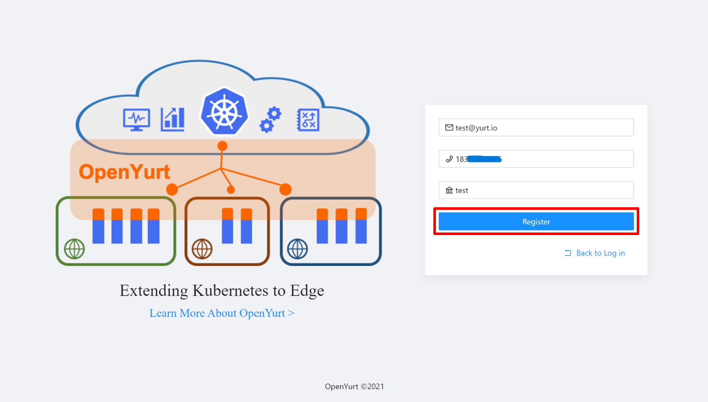
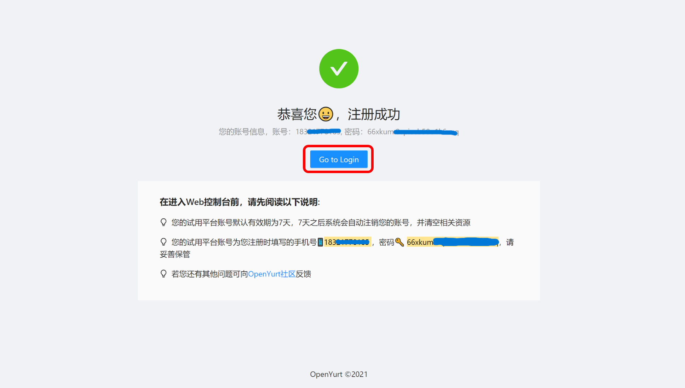
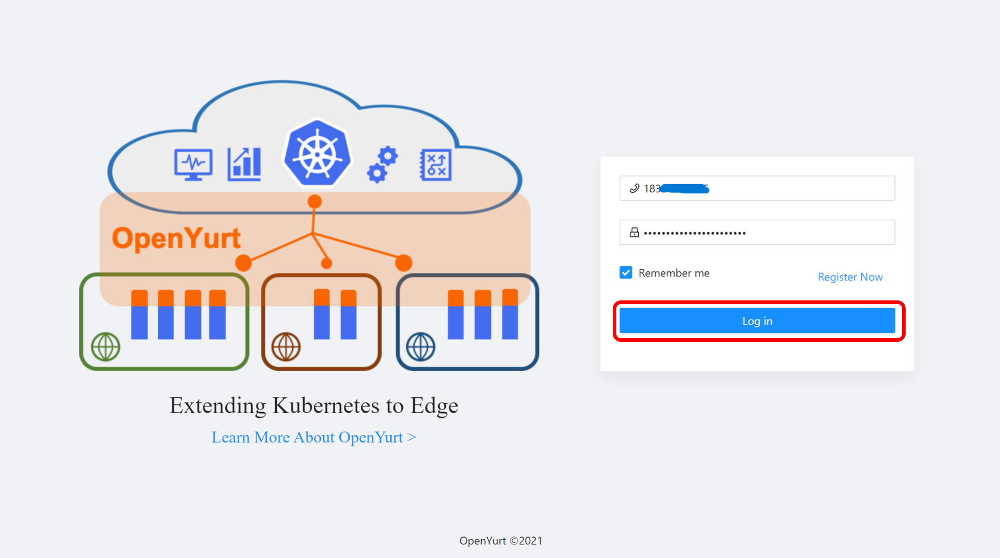
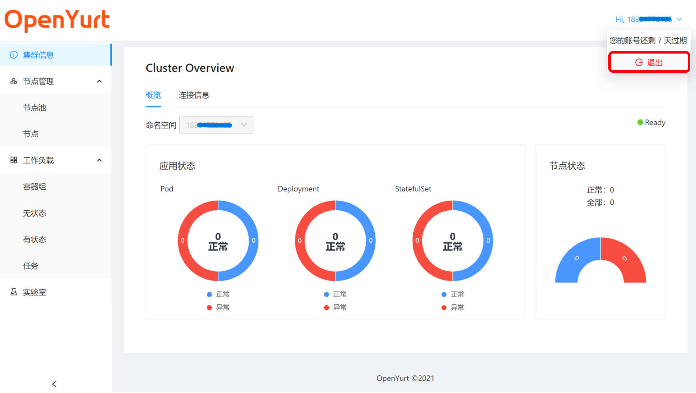

> This document will describe how to use the user management features of the Experience Center to register, log in, and log out of your account.

## Registration

If you are using the experience platform for the first time, you need to register a platform account.

Three types of information are required

- E-mail
- Phone number
- Organization

> Note：
>
> 1. The email and phone number need to match the corresponding format requirements.
> 2. The phone number will be used as your login username, so you cannot register two accounts with the same phone number.

Once the information are filled in, click the Register button.

During the registration process, in addition to creating new user accounts, the system will also create the appropriate cluster resources for you, so there may be a slight wait of 3-5s.

After successful creation, the user's account information will be displayed in the browser.

> Note：
>
> 1. Please take care of the token, which will then be used as a password for your account.
> 2. The default expiration date of the account is 7 days, after which time the allocated cluster resources will be withdrawn.

If registration fails, please note the error message displayed by your browser. If you can rule out network problems and duplicate registrations, please report the issue to [OpenYurt community](https://github.com/openyurtio/openyurt#contact) (you can also [submit an issue](https://github.com/openyurtio/yurt-dashboard/issues) directly to the yurt-dashboard repository).

## Login

Once you have successfully registered, click the Go to Login button to return to the login page. The username and password for your new account will be automatically filled for you, and you can use the "Remember Password" feature provided by your browser to save the password information in your browser. In addition, the Remember me button will be checked and you will be automatically logged in the next time you visit the Experience Platform when it is in the check state.

After clicking the login button, you will, not surprisingly, get an OpenYurt cluster of your own. As you can see the cluster has no applications and no nodes yet (or only one invisible Master node), you will find how to [use the web console](./web_console.md) and [kubeconfig](./kubeconfig.md) to experience the power of OpenYurt in the following documentation. 

## Logout

You can see the account expiration information in the user information bar in the upper right corner and log out of your current account.

